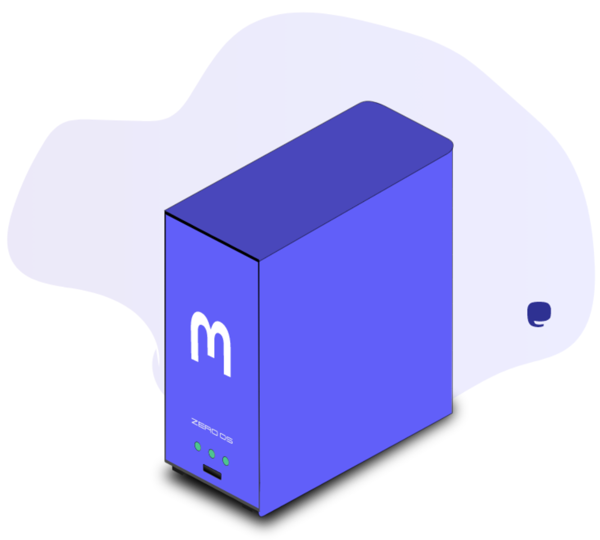

<!-- section 1 -->



 
 

## GET YOUR  MASTODON SERVER

**Mastodon** is an open-source self-hosted   
social networking platform  
run by a network of large number of   
independently run nodes, known as instances.  
  
ThreeFold has made it possible for everyone to run their own Mastodon Instance, simply and effectively.
Own or co-own a Mastodon server now!

<button>[GET SERVER](https://getmastodon.threefold.io/)</button>

|||



<!-- section 2 (header) -->



# EASY   DEPLOYMENT



<!-- section 3 -->



### ADD CREDENTIALS

EasIly login to, or create a new Mastodon deployment account

|||

### **TOP UP WALLET**

Top up your deployment wallet with TFT to keep your Mastodon Server alive 

|||

### **DEPLOY SERVER**

Configure the Server details, such as location, and deployment size, and deploy your own Mastodon!


<!-- section 4 -->

 

 



<button>[GET SERVER](https://getmastodon.threefold.io/)</button>


