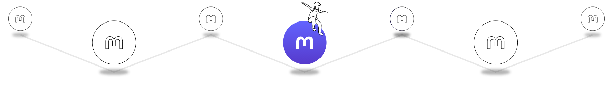
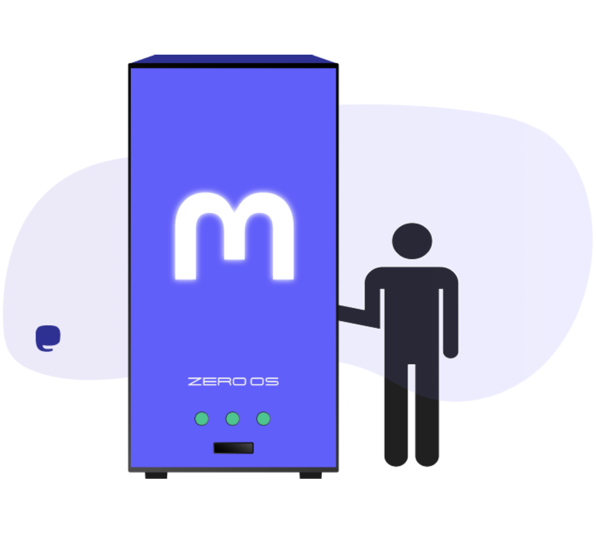
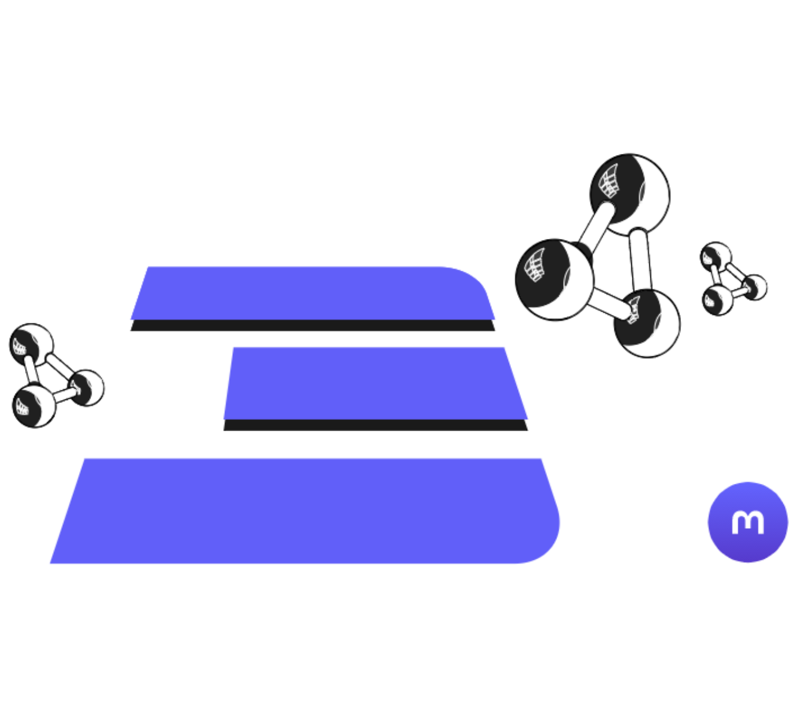
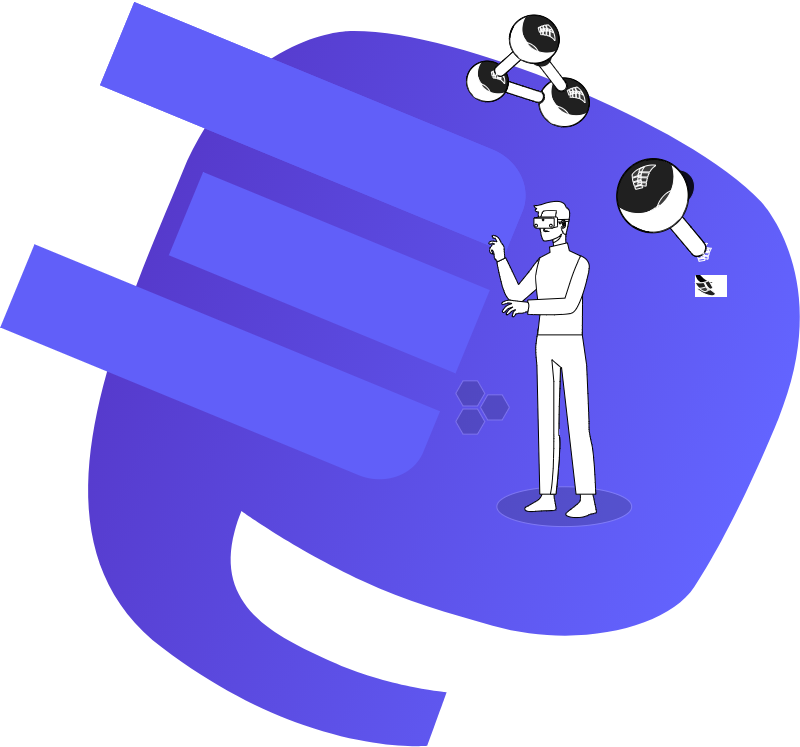
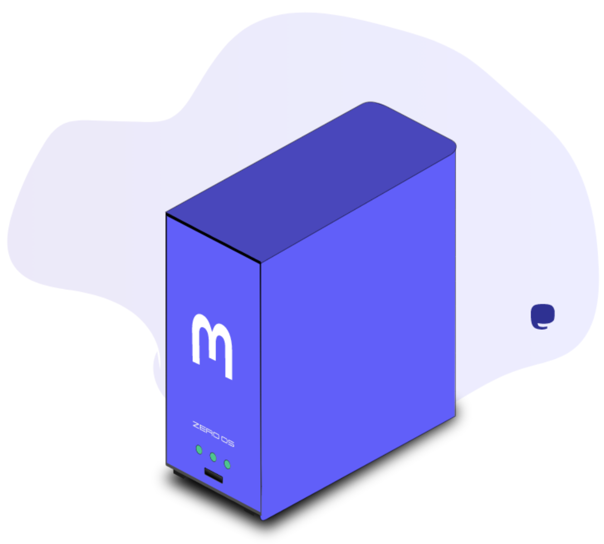

<!-- section 1 (header) -->



 
 
 

 

# TRULY DECENTRALIZED  MASTODON SERVERS

 

Deploy and fully control your own Mastodon server on the  world’s largest decentralized network.

 

<button>[GET STARTED](/getserver)</button>

 



<!-- section 2 -->



## YOUR OWN   
## DECENTRALIZED SERVER   

No need to rely on a third party’s server, 
when you can own and manage your own  
private and secure Mastodon server 
hosted by ThreeFold.
 
 
**Own or co-own a Mastodon server now!**

<button>[GET SERVER](/getserver)</button>

 

|||



<!-- section 3 -->

 


|||

## POWERED BY THREEFOLD’S   P2P INFRASTRUCTURE

Our fully decentralized network offers an unparalleled level of security, privacy and scalability to all Mastodon servers.

<button>[KNOW MORE](https://library.threefold.me/info/threefold#/tfgrid/threefold__grid_home)</button>

 



<!-- section 4 -->



## EARN  REWARDS

Servers allow you to offer decentralized storage to other Mastodon users.  Get your server and start earning ThreeFold Tokens!

<button>[KNOW MORE](/getserver)</button>

 



<!-- section 2 (header) -->



## SAFER LOGIN   OPTIONS


<!-- section 3 -->



### EMAIL LOGIN

Easy and conventional Mastodon server login via 'registered email address and password' method is available for all users.

|||

### **TF CONNECT APP AUTHENTICATOR**

An option for an extra layer of security by adding the decentralized TF Connect App login method to your Mastodon server is available. 

|||

### **USER VERIFICATION**

Premium users can add the ultimate level of security with the option of adding KYC procedure for their Mastodon audience.



<!-- section 4 -->


<button>[GET SERVER](https://getmastodon.threefold.io/)</button>



<!-- section 6 -->



|||

## THREEFOLD'S   FEED

Stay up to date with ThreeFold's latest news by following ThreeFold’s Official Mastodon channel.

<button>[VIEW FEED](/threefoldfeed)</button>

 
 



<!-- section 7 -->



## GET YOUR FREE MASTODON SERVER

The first to reserve ThreeFold’s  
Mastodon servers will receive  
full support in hosting and offering storage.
 
Own or co-own a server now!

<button>[GET SERVER](/getserver)</button>

 
 

|||


